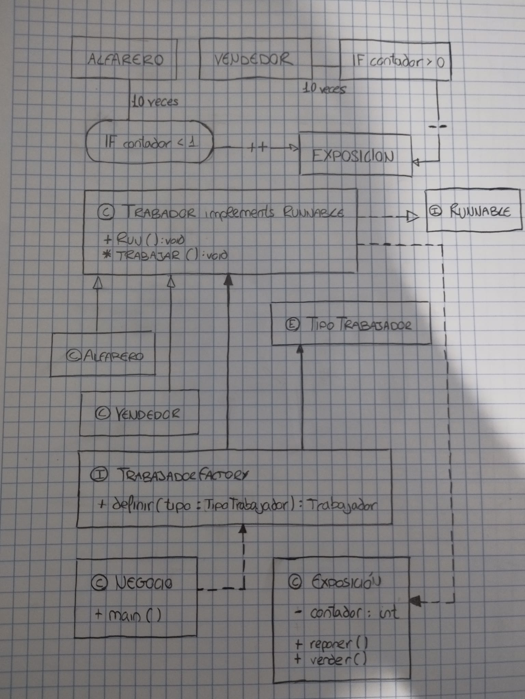

# NEGOCIO DE CERÁMICA PSP
```
git clone 
```
## DISEÑO Y ANÁLISIS


Este proyecto simula un negocio con dos trabajadores, un alfarero y un vendedor, pensé que como ambos son trabajadores de este negocio esta podría ser su clase padre, que podría implementar de por sí la interfaz *Runnable* y así heredaría las funciones de dicha interfaz a sus hijos, permitiéndoles adquirir la función de hilos. Esta clase también contendría un método abstracto, trabajar, un método vacío que ganaría una función dependiendo del hijo, en el caso de la clase *Alfarero* este llamará al método *reponer()* en la clase *Exposicion*, y en la clase *Vendedor* a *vender()*. Puesto que este proyecto busca que el alfarero cree 10 obras y el vendedor las venda, limitando el número simultáneo de obras en exposición a 1, introduje un for en el método *trabar()* de *Alfarero* y *Vendedor*, de tal forma que cada uno llame a su respectivo método de la clase *Exposición* 10 veces, además estos métodos pondrán el hilo que haga falta en espera para que el atributo *contador* no suba de 1 o baje de 0.

**LA CLASE TRABAJADOR DEBERÍA SER ABSRACTA, AL PARECER NO LO ESPECIFIQUÉ EN EL DISEÑO, ME DISCULPO, SERÍA SIMPLEMENTE CAMBIAR LA *C* POR UNA *A***

## CÓDIGO

### CLASE 